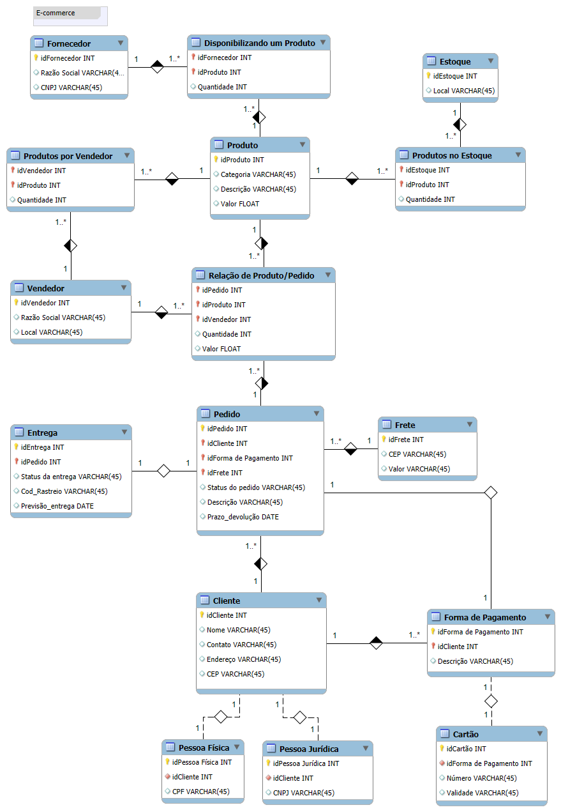

# Refinando um Projeto Conceitual de Banco de Dados – E-COMMERCE

O objetivo desse desafio foi refinar um Modelo Lógico de um banco de dados de um E-commerce.

A criação desse modelo foi conduzida até certo ponto, enquanto o desenvolvimento da parte restante foi o desafio proposto.

### Alterações
 - O Vendedor Terceirizado foi alterado para apenas Vendedor, podendo ser adicionado o próprio E-commercer como vendedor.
 - Foi adicionado o idVendedor em Relação Produto/Vendedor para identificar o vendedor do produto que está sendo comprado.
 - Foi criada a entidade Entrega com os atributos: status de entrega, código de rastreio e previsão de entrega.
 - Foi feita uma relação de 1:1 entre Entrega e Produto.
 - Foi criada a entidade Frete com os atributos CEP e valor. Com isso é possível definir o valor do frete para diferentes endereços.
 - Foi criada as entidades Pessoa Física com CPF e Pessoa Jurídica com CNPJ. A entidade Cliente precisa se especializar em uma dessas entidades.
 - Foi criada a entidade Forma de pagamento relacionada com Cliente. Um cliente pode ter várias formas de pagamento.
 - Foi criada a entidade Cartão como uma forma de pagamento com seus atributos. A Forma de Pagamento pode se especializar em Cartão.

## Modelo Lógico

